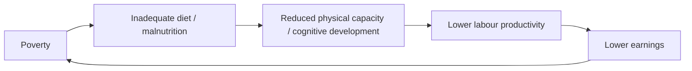

# ECON 503 -- Development Economics

## MSC Tutorial Question 4 -- SDG Challenges to Development Pathways and SDG 1 / Food Security (20 Marks)

> **Index:** [`answers-development.md`](../answers-development.md) **Cross-ref:** Todaro & Smith Ch. 2 (SDG/environment sections), UN SDG Framework
>
> **Question:** How does the concept of SDG challenge other economic development pathways so forth? How does SDG 1 can be related to secure global food security?

---

## Part A -- How SDGs Challenge Traditional Development Pathways (10 Marks)

### 1. Traditional Development Pathways: A Brief Overview

Before evaluating the challenge posed by the Sustainable Development Goals (SDGs), it is necessary to understand the conventional development paradigms they supersede.

| Paradigm | Core Logic | Period | Key Features | Criticisms |
|----------|-----------|--------|--------------|------------|
| **Rostovian Stages Model** (Rostow, 1960) | All societies pass through five linear stages: traditional society, preconditions for take-off, take-off, drive to maturity, age of high mass consumption | 1950s-60s | Linear, Eurocentric, unidirectional; development = industrialisation | Ignores structural constraints; assumes all countries follow same historical path; no allowance for external exploitation or path dependency |
| **Washington Consensus** (Williamson, 1989) | 10 policy prescriptions: fiscal discipline, trade liberalisation, privatisation, deregulation, secure property rights | 1980s-90s | Market fundamentalism; macroeconomic stabilisation; structural adjustment programmes (SAPs) | Growth without equity; "lost decade" in Latin America; rising inequality; weak institutional foundation |
| **Trickle-Down Economics** | Growth at the top eventually benefits the poor through employment, lower prices, and investment | 1980s onward | Focus on aggregate GDP growth; redistribution postponed | Empirical evidence weak; inequality often rises before benefits trickle down; Kuznets hypothesis not universally confirmed |
| **MDG Framework** (2000-2015) | 8 goals, 21 targets, 60 indicators focused on poverty, health, education | 2000-2015 | Measurable, time-bound, results-oriented; North-South aid framework | Top-down formulation; developing-country focused only; siloed goals; did not address root causes of poverty or environmental sustainability |

Each of these pathways shared a common limitation: they treated economic growth (measured by GDP per capita) as both the primary means and the ultimate end of development, and they operated within a donor-recipient (North-South) framework that exempted wealthy countries from transformative obligation.

---

### 2. The SDG Framework (2015-2030): A Paradigm Shift

The 2030 Agenda for Sustainable Development, adopted by all UN Member States in 2015, established 17 Sustainable Development Goals with 169 targets and 232 indicators. The framework represents a fundamental departure from earlier approaches in several structural dimensions.

| Dimension | MDGs (2000-2015) | SDGs (2015-2030) |
|-----------|------------------|------------------|
| **Number of goals** | 8 | 17 |
| **Number of targets** | 21 | 169 |
| **Scope** | Social-sector focus (poverty, health, education) | Economic, social, AND environmental -- three pillars of sustainability |
| **Geographic focus** | Developing countries (donor-recipient model) | Universal -- ALL countries, including high-income |
| **Formulation process** | Top-down (UN experts + donor agencies) | Most inclusive participatory process in UN history; civil society, private sector, academia |
| **Theoretical anchor** | Human development + basic needs | Sustainable development, planetary boundaries, intergenerational equity |
| **Inequality** | Not explicitly addressed (MDG 1 focused on absolute poverty only) | Goal 10: "Reduce inequality within and among countries" |
| **Environmental sustainability** | MDG 7 (ensure environmental sustainability) -- narrow | Mainstreamed across multiple goals (6, 7, 11, 12, 13, 14, 15) |
| **Implementation** | Aid-dependent; developing countries as recipients | Means of implementation (SDG 17); domestic resource mobilisation; technology transfer; multi-stakeholder partnerships |
| **Underlying philosophy** | "Help the poor catch up" | "Transform the global system so no one is left behind" |

---

### 3. Six Key Challenges the SDGs Pose to Conventional Thinking

#### Challenge 1: Challenge to GDP Fetishism -- Well-being Beyond Income

Traditional development pathways treated GDP growth as synonymous with development. The SDGs reject this equation by embedding **multidimensional well-being** at the centre of the framework.

- **GDP limitations:** GDP measures market transactions, not welfare. It counts defensive expenditures (e.g., cleaning up pollution) as growth, ignores unpaid care work (disproportionately performed by women), and says nothing about distribution.
- **SDG alternative:** The SDGs incorporate indicators that go far beyond income: life expectancy (SDG 3), educational attainment (SDG 4), gender equality (SDG 5), clean water access (SDG 6), and subjective well-being. The UN's "Beyond GDP" initiative, endorsed by Secretary-General Guterres, explicitly calls for complementing GDP with metrics that capture human and ecological well-being.
- **Complementary indices:** The Human Development Index (HDI), the Multidimensional Poverty Index (MPI), the Genuine Progress Indicator (GPI), and the OECD Better Life Index all reflect this shift.

> **Theoretical insight:** The SDGs embody Amartya Sen's **capabilities approach** -- development is the expansion of human freedoms and capabilities, not merely the accumulation of commodities. This directly challenges the utilitarian foundations of GDP-centric development.

#### Challenge 2: Challenge to Growth-First -- Planetary Boundaries and Environmental Sustainability

The Washington Consensus and Rostovian stages implicitly assumed that environmental degradation is a necessary cost of growth that can be addressed later (the "grow now, clean up later" hypothesis). The SDGs reject this **Environmental Kuznets Curve** assumption.

- **Planetary boundaries framework** (Rockstrom et al., 2009): The SDGs implicitly recognise that the Earth system has nine critical thresholds (climate change, biosphere integrity, land-system change, freshwater use, biogeochemical flows, ocean acidification, atmospheric aerosol loading, stratospheric ozone depletion, novel entities). Four boundaries are already crossed.
- **SDG 13** (Climate Action), **SDG 14** (Life Below Water), and **SDG 15** (Life on Land) explicitly require growth to occur within ecological limits.
- **SDG 8** (Decent Work and Economic Growth) calls for "sustained, inclusive and sustainable economic growth" -- the inclusion of the word "sustainable" is deliberate and transformative. Growth must be **decoupled** from resource use and environmental degradation.
- **Degrowth and post-growth scholarship:** While the SDGs do not endorse degrowth, they open space for growth-critical perspectives by refusing to treat GDP growth as an unconditional good.

#### Challenge 3: Challenge to Trickle-Down -- Explicit Focus on Inequality

Trickle-down economics assumed that growth at the top would eventually benefit the poor through employment linkages and investment. The SDGs challenge this assumption through multiple mechanisms.

- **SDG 10** (Reduced Inequalities) is a standalone goal -- a first in UN development frameworks. It targets income growth for the bottom 40% above the national average (Target 10.1), social, economic and political inclusion (Target 10.2), and equality of opportunity (Target 10.3).
- **"Leave No One Behind"** is the cross-cutting principle of the 2030 Agenda. This requires disaggregated data (by income, sex, age, race, ethnicity, migratory status, disability, geographic location) to identify and reach the most marginalised.
- **SDG 1** explicitly targets the extreme poor (Target 1.1) and calls for social protection systems (Target 1.3) -- a direct challenge to the Washington Consensus emphasis on minimal safety nets.

> **Empirical evidence:** Piketty (2014) documented that when the top 1% capture most growth, trickle-down fails. The SDGs respond by making distributional outcomes -- not just aggregate growth -- a measure of development success.

#### Challenge 4: Challenge to Siloed Policymaking -- Integrated Cross-Sectoral Approach

Traditional development was organised in sectoral silos (health, education, agriculture, infrastructure) with separate ministries, budgets, and programmes. The SDGs demand **policy coherence** and **integrated planning**.

- The 17 goals are explicitly interlinked. Progress on one goal affects others (both synergies and trade-offs). For example:
  - Improving food security (SDG 2) requires poverty reduction (SDG 1), agricultural investment (SDG 9), climate resilience (SDG 13), gender equality (SDG 5), and clean water (SDG 6).
  - Expanding education (SDG 4) improves health (SDG 3), reduces poverty (SDG 1), and promotes gender equality (SDG 5).
- The **SDG Interlinkages framework** (developed by IGES and the JRC) maps causal relationships between targets to help policymakers identify synergies and avoid trade-offs.
- This challenges the traditional project-based approach of development agencies, where outcomes were evaluated within single sectors.

> **Policy implication:** Siloed governance structures (line ministries with limited coordination) are structurally inadequate for SDG implementation. Countries that have made the most progress -- such as Finland and Sweden -- have established high-level cross-ministerial coordination mechanisms.

#### Challenge 5: Challenge to the North-South Divide -- Universal Agenda

The MDGs were implicitly a contract between "rich donors" and "poor recipients." The SDGs are **universal**: they apply to every country, including the world's wealthiest.

- **High-income countries** must address: domestic inequality (SDG 10), sustainable consumption and production patterns (SDG 12), climate action (SDG 13), and biodiversity conservation (SDG 15).
- **Means of implementation** (SDG 17) still recognise the principle of Common But Differentiated Responsibilities (CBDR), but the universal framing means developing countries also hold themselves accountable for environmental goals.
- This challenges the traditional development economics dichotomy between "developed" and "developing" countries, replacing it with a continuum where all nations face sustainability challenges.

#### Challenge 6: Challenge to Short-Termism -- Intergenerational Equity

Political cycles (typically 4-5 years) and market incentives (quarterly reporting) favour short-term decision-making. The SDGs operate on a **15-year horizon** (2015-2030) with an explicit commitment to **intergenerational equity**.

- The concept of "sustainable development" -- defined by the Brundtland Commission (1987) as "development that meets the needs of the present without compromising the ability of future generations to meet their own needs" -- is embedded in the SDGs.
- **SDG targets explicitly reference sustainability:** Target 8.4 (improve resource efficiency and decouple growth from environmental degradation), Target 12.2 (sustainable management and efficient use of natural resources), Target 13.2 (integrate climate change measures into national policies).
- This challenges the standard discounting approach in cost-benefit analysis, where future well-being is heavily discounted relative to present consumption.

---

### 4. Summary Table: SDG Challenges to Traditional Pathways

| Traditional Assumption | SDG Challenge | SDG Mechanism |
|-----------------------|---------------|---------------|
| GDP growth is the objective of development | Well-being is multidimensional and includes health, education, equality, and environmental quality | Beyond-GDP indicators; HDI, MPI; targets across 17 goals |
| Growth can precede environmental protection | Growth must operate within planetary boundaries | SDG 13, 14, 15; decoupling requirements in SDG 8 |
| Benefits of growth trickle down to the poor | Inequality must be explicitly addressed; the poor must benefit proportionally more | SDG 10; "leave no one behind"; Target 10.1 (bottom 40% grows faster) |
| Development policy operates in sectoral silos | All 17 goals are interlinked; policy coherence required | SDG interlinkages framework; integrated national planning |
| Development is a North-South issue (donors help recipients) | All countries face sustainability challenges; universal agenda | SDGs apply to high-income countries too; SDG 17 (partnerships) |
| Short-term outcomes (5-year plans, election cycles) | Long-term sustainability and intergenerational equity | 2030 horizon; sustainable development principle |
| Market forces allocate resources efficiently | Social protection, public goods, and deliberate pro-poor targeting are necessary | Target 1.3 (social protection); Target 2.1 (food security) |

---

## Part B -- How SDG 1 Relates to Global Food Security (10 Marks)

### 5. SDG 1: No Poverty -- Targets and Rationale

SDG 1 aims to "end poverty in all its forms everywhere" and is operationalised through seven targets:

| Target | Description | Key Indicator |
|--------|-------------|---------------|
| **1.1** | Eradicate extreme poverty (people living on < $2.15/day, 2017 PPP) by 2030 | Proportion of population below international poverty line |
| **1.2** | Reduce at least by half the proportion of men, women, and children living in poverty in all its dimensions | National poverty headcount ratio; Multidimensional Poverty Index |
| **1.3** | Implement nationally appropriate social protection systems and measures for all, including floors | Proportion of population covered by social protection systems |
| **1.4** | Ensure all have equal rights to economic resources, access to basic services, ownership and control over land | Proportion of population with secure tenure rights |
| **1.5** | Build resilience of the poor and reduce their exposure to climate-related extreme events and economic shocks | Number of deaths, missing persons, and economic loss from disasters |
| **1.A** | Ensure significant mobilisation of resources for poverty eradication | Proportion of government spending on essential services |
| **1.B** | Create pro-poor policy frameworks at national, regional, and international levels | Pro-poor policy index |

### 6. SDG 2: Zero Hunger -- The Food Security Goal

SDG 2 aims to "end hunger, achieve food security and improved nutrition, and promote sustainable agriculture." Its key targets:

| Target | Description |
|--------|-------------|
| **2.1** | End hunger and ensure access to safe, nutritious, and sufficient food for all, year-round |
| **2.2** | End all forms of malnutrition (stunting, wasting in children; anaemia in women) |
| **2.3** | Double agricultural productivity and incomes of small-scale food producers |
| **2.4** | Ensure sustainable food production systems and resilient agricultural practices |
| **2.5** | Maintain genetic diversity of seeds, cultivated plants, and farmed animals |

### 7. The Poverty-Food Security Nexus: Four Transmission Channels

The relationship between SDG 1 and food security is bidirectional and mutually reinforcing. Poverty is both a cause and a consequence of food insecurity.

#### Channel 1: Income Constraints and Food Access (Demand Side)

- Poor households spend **50-70% of their income on food** (compared to 10-15% in high-income countries). This high food expenditure share means that **food price shocks directly and severely impact real incomes**.
- A 10% increase in food prices can increase the poverty headcount by 1-2 percentage points in low-income countries (World Bank, 2020 estimate for the 2007-08 food crisis: 105 million additional people pushed into poverty).
- **Food inflation in Bangladesh** reached 10.7% in January 2025 (World Bank Food Security Update), with disproportionate impact on the bottom 40% of households.

#### Channel 2: Nutrition, Labour Productivity, and the Poverty Trap (Supply Side)

The relationship forms a classic **poverty trap**:

- **Stunting** (low height-for-age) affects 22% of children under 5 globally (WHO, 2023). Stunted children grow up to earn 20-25% less as adults (Victora et al., 2008; Hoddinott et al., 2013).
- **Anaemia** affects 30% of women of reproductive age globally, reducing work capacity and wages.
- The **Bangladesh Integrated Household Survey** (IFPRI, 2022) found that despite Bangladesh's massive reduction in extreme poverty (from 12.9% in 2016 to 5.6% in 2022), child stunting remains at 30.8% -- a stubborn nutrition challenge that undermines future productivity and poverty reduction.

#### Channel 3: Smallholder Agriculture and Rural Poverty

- **70% of the world's extreme poor live in rural areas** and depend on agriculture for their livelihoods (World Bank, 2023).
- Smallholder farmers (operating < 2 hectares) produce **30-35% of the world's food** but are themselves the most food-insecure population group.
- **Agricultural growth reduces poverty 2-3 times more effectively than growth in other sectors** (Christiaensen, Demery, and Kuhl, 2011; World Development Report 2008). This is known as the **agricultural growth-poverty elasticity**.

| Region | Poverty Elasticity of Agricultural Growth | Poverty Elasticity of Non-Agricultural Growth |
|--------|------------------------------------------|----------------------------------------------|
| Sub-Saharan Africa | -1.9 | -0.8 |
| South Asia | -1.6 | -0.7 |
| East Asia | -1.3 | -0.6 |
| Latin America | -0.8 | -1.2 |

Source: Ligon and Sadoulet (2018), World Bank

- **Why agriculture has a higher poverty-reducing effect:** (a) agriculture directly employs the poor; (b) agricultural growth lowers food prices, benefiting poor net consumers; (c) backward and forward linkages create rural non-farm employment; (d) poor households spend additional income on locally produced goods, generating multiplier effects.

#### Channel 4: Climate Change as a Threat Multiplier

Climate change simultaneously threatens both poverty reduction and food security, creating a **compounding vulnerability** for poor agricultural households.

- By 2030, climate change could push an additional **132 million people into extreme poverty** (FAO, 2024), disproportionately affecting smallholder farmers, pastoralists, and fisherfolk.
- **Agricultural productivity in developing countries may decline by 15-20% by 2050** due to climate change (IPCC, 2022), with Sub-Saharan Africa and South Asia worst affected.
- **Bangladesh context:** Bangladesh is the 9th most climate-vulnerable country (Germanwatch). Rising sea levels, salinity intrusion, erratic monsoon patterns, and extreme heat are reducing rice yields. The Boro rice variety -- the country's principal irrigated crop -- is particularly affected by rising nighttime temperatures.

---

### 8. Policy Links: Social Protection (SDG 1.3) and Food Security

Target 1.3 calls for "nationally appropriate social protection systems." These are a critical bridge between SDG 1 and food security:

| Social Protection Type | Food Security Mechanism | Evidence |
|-----------------------|------------------------|----------|
| **Cash transfers** | Increase household purchasing power for food | Bangladesh's Old Age Allowance, Widow Allowance; reduce food insecurity by 8-15% in recipient households |
| **In-kind food transfers** | Direct calorie intake improvement | Bangladesh's Open Market Sales (OMS) programme; Food-Friendly Programme (FFP) providing 30kg rice/month in lean seasons |
| **Public works programmes** | Income generation + asset creation for food production | Employment Generation Programme for the Poorest (EGPP) |
| **School feeding programmes** | Direct nutrition for children + reduces household food expenditure | National School Feeding Programme; covers 3+ million children |
| **Agricultural input subsidies** | Reduces cost of food production for smallholders | Fertiliser and seed subsidies in Bangladesh; ~2% of GDP |

> **Critical point:** Social protection alone is insufficient. It must be complemented by agricultural investment, nutrition-sensitive interventions, and climate adaptation to break the poverty-food insecurity cycle.

---

### 9. The 2-3x Agricultural Growth Multiplier: Empirical Evidence

The claim that agricultural growth reduces poverty 2-3 times more than non-agricultural growth requires careful contextualisation:

- **Mechanism:** Agriculture in low-income countries is more labour-intensive, employs more poor people directly, produces staple goods consumed by the poor, and has stronger backward linkages (input suppliers) and forward linkages (food processing, marketing).
- **Conditional:** The multiplier effect is strongest where smallholder farming dominates and where smallholders are connected to markets. It weakens where agriculture is large-scale, capital-intensive, and export-oriented (e.g., Brazil's soybean sector).
- **Declining over time:** As economies develop and agriculture's share of GDP falls, the relative advantage of agricultural growth diminishes -- but in the poorest countries (where SDG 1 and SDG 2 challenges are most acute), it remains the most powerful lever.

---

### 10. Bangladesh Context: Progress and Persistent Challenges

Bangladesh offers a compelling case study of both the potential and the limits of the SDG 1-food security nexus.

| Indicator | 1991 | 2005 | 2016 | 2022 | SDG Target (2030) |
|-----------|------|------|------|------|--------------------|
| Extreme poverty headcount (%) | ~44% | 25.1% | 12.9% | 5.6% | 0% (Target 1.1) |
| Moderate poverty headcount (%) | ~59% | 40.0% | 24.3% | 18.7% | < 10% (Target 1.2) |
| Prevalence of undernourishment (%) | 35% | 24% | 13% | ~11% | 0% (Target 2.1) |
| Child stunting (% under 5) | 64% | 43% | 36% | 30.8% | < 20% |
| Daily calorie intake (kcal/person) | ~2,050 | ~2,200 | 2,210 | 2,393 | > 2,500 |
| GDP growth (annual average) | 4.5% | 5.8% | 7.1% | 6.0% | 8%+ (national target) |

**Achievements:**
- Bangladesh met MDG 1 (halve poverty) ahead of 2015.
- Poverty reduction has been remarkably broad-based, with rural areas experiencing faster reduction than urban areas.
- Rice production tripled since 1971 (from 10M tons to 36M tons), achieving near self-sufficiency.
- Social protection coverage expanded from 2% of GDP (2010) to 3.2% of GDP (2023).

**Persistent challenges:**
- **Nutrition transition incomplete:** Despite rising incomes, stunting and anaemia remain high. Calorie intake is below recommended levels for the bottom 40%. Diets lack diversity (over-reliance on rice).
- **Inequality rising:** The Gini coefficient increased from 0.458 (2010) to 0.499 (2022). The benefits of growth have not been evenly shared.
- **Climate vulnerability:** 70% of Bangladesh's landmass is prone to flooding. Salinity intrusion in coastal areas is reducing cultivable land for rice, pulses, and vegetables.
- **Agricultural systems under stress:** Smallholder fragmentation (average farm size fell from 0.91 ha in 1988 to 0.45 ha in 2022); groundwater depletion; rising input costs; labour shortage due to rural-urban migration.
- **Food inflation:** 10.7% in January 2025, eroding real incomes and pushing vulnerable non-poor households into food insecurity.

---

### 11. Integrated SDG 1-SDG 2 Policy Framework

| Pathway | SDG 1 Contribution | SDG 2 Contribution | Synergy |
|---------|-------------------|--------------------|---------|
| **Smallholder productivity** (Target 2.3) | Direct income increase for rural poor | Increased food availability | Higher yields raise farmers' incomes AND food supply; reduces rural poverty and food prices simultaneously |
| **Social protection** (Target 1.3) | Direct poverty reduction; income floor | Improved food access for vulnerable | Cash transfers increase food purchasing power; nutrition-sensitive transfers improve dietary quality |
| **Climate-resilient agriculture** (Target 2.4) | Protects poor farmers' asset base | Maintains food production under climate stress | Adaptation investments reduce both poverty and food insecurity in the long run |
| **Nutrition-sensitive interventions** (Target 2.2) | Breaks the intergenerational poverty trap | Addresses stunting, wasting, anaemia | Better-nourished children become more productive adults; reduces future poverty |
| **Women's empowerment** (SDG 5) | Women-headed households are poorer; empowering women reduces poverty | Women are primary food producers and caregivers | Female farmers have lower yields (20-30% gap) due to unequal access to inputs; closing the gap reduces both poverty and food insecurity |

---

### 12. Exam Tips

**For the 10-mark Part A (How SDGs challenge traditional pathways):**

- Start by briefly characterising the conventional paradigms: Washington Consensus (GDP-centric, market fundamentalism), Rostovian stages (linear), trickle-down (distribution deferred), and MDGs (narrow social-sector focus).
- Structure your answer around the **six challenges** presented above. The table in Section 3 is a useful quick-reference for revision.
- For each challenge: (i) what the traditional assumption was, (ii) why it is problematic, (iii) how the SDGs explicitly address it.
- Emphasise the **paradigm shift** from GDP fetishism to multidimensional well-being, from North-South to universal, and from siloed to integrated.
- Reference the relevant SDG numbers (e.g., SDG 10 for inequality, SDG 13-15 for environment).
- Use theoretical anchors: Sen's capabilities approach for the well-being critique; Rockstrom's planetary boundaries for the environmental critique; Piketty's inequality evidence for the trickle-down critique.

**For the 10-mark Part B (SDG 1 and food security):**

- Begin by defining both SDG 1 and SDG 2 targets clearly.
- Structure around the **four transmission channels**: income constraints (demand), nutrition-poverty trap (supply), smallholder agriculture, and climate change.
- **The 2-3x agricultural growth multiplier** is a signature argument -- cite it explicitly with the table from Section 7.
- Apply the framework to **Bangladesh** as a case study. Use the table in Section 10 for specific numbers.
- Conclude with policy integration: social protection + agricultural investment + climate adaptation = the synergy pathway.
- Mention the FAO/World Bank evidence on social protection and food security linkages.

**Common mistakes to avoid:**

- Do NOT simply list the 17 SDGs -- you need to analyse how they challenge existing thinking.
- Do NOT treat SDG 1 and SDG 2 as separate -- the whole point is their interlinkage.
- Do NOT claim Bangladesh has solved food insecurity -- emphasise the remaining challenges (nutrition, inequality, climate).
- Do NOT forget the "planetary boundaries" dimension of the SDGs -- this is what distinguishes them from MDGs.
- Do NOT ignore the universal character of SDGs (applicable to ALL countries, not just developing).
- Do NOT make normative claims (e.g., "the SDGs are good") without analytical support.

---

### 13. Professor's Corner

> This question is designed to test your understanding of the **most significant shift in international development thinking since the 1980s**. The SDGs represent not just an expanded list of goals but a fundamentally different philosophy of what development means and how it should be pursued.
>
> **Key analytical points the examiner is looking for:**
>
> 1. **Recognition of the paradigm shift**: The best answers will show awareness that the SDGs challenge the very definition of "development" -- from income-centred to well-being-centred, from growth-first to sustainability-constrained, from trickle-down to deliberately pro-poor and equality-focused. This is a Kuhnian paradigm shift in development thinking.
>
> 2. **Critical perspective**: Do NOT present the SDGs uncritically. A sophisticated answer acknowledges criticisms: (a) 169 targets are too many for policy prioritisation; (b) the goals contain internal contradictions (e.g., SDG 8 [economic growth] vs. SDG 13 [climate action]); (c) the SDGs are not legally binding; (d) financing remains inadequate (developing countries face an estimated $4 trillion annual financing gap for SDGs); (e) monitoring and accountability mechanisms are weak. A "Professor's Corner" quality answer balances acknowledgement of the SDGs' transformative potential with awareness of their limitations.
>
> 3. **Theory grounding**: The best answers connect SDG 1-food security links to established development theory:
>    - **Poverty trap models** (Azariadis and Stachurski, 2005; Sachs et al., 2004): Malnutrition as a mechanism that keeps households below the threshold for self-sustaining accumulation.
>    - **Nutrition-based efficiency wage theory** (Leibenstein, 1957; Dasgupta and Ray, 1986): Low wages lead to low nutrition, low productivity, and low wages in a self-reinforcing cycle.
>    - **Entitlement theory** (Sen, 1981): Famine and food insecurity are not just about food availability (Malthusian) but about people's ability to command food through legal means (production-based, trade-based, labour-based, or transfer-based entitlements). SDG 1's focus on poverty and social protection directly addresses the entitlement failure at the root of food insecurity.
>    - **Structural transformation** (Lewis, 1954; Timmer, 1988): The shift from agriculture to industry and services as the path out of poverty. The SDGs complicate this by adding environmental sustainability as a binding constraint.
>
> 4. **Cross-reference to other course material**: Connect to:
>    - The **neoclassical counterrevolution** (Q9 of Batch 47 exam): The SDGs can be read as a response to the failures of market fundamentalism.
>    - **Kabeer's agency framework**: The SDGs' emphasis on "leave no one behind" resonates with Kabeer's concern for the most marginalised and their capacity to exercise agency.
>    - **Resource curse** (Venezuela, Iran): SDG 17 (partnerships) and SDG 16 (strong institutions) address the governance failures that underlie the resource curse.
>    - **Convergence theory**: The SDGs reject unconditional convergence as a development strategy and instead argue for deliberate intervention (social protection, agricultural investment, climate adaptation) to overcome poverty traps and ensure inclusive growth.
>
> 5. **Empirical grounding**: Use the Bangladesh data (Section 10) to show you can apply the analytical framework to a real case. Bangladesh's trajectory -- from 44% extreme poverty in 1991 to 5.6% in 2022 -- is one of the most dramatic poverty reductions in history. Yet the persistence of stunting (30.8%) and rising inequality (Gini 0.499) show that poverty reduction in income terms does not automatically translate into food security and nutrition outcomes. This disconnect is exactly the kind of analytical puzzle a good answer should address.
>
> **Must-read references for deeper understanding:**
> - Todaro & Smith, *Economic Development*, Ch. 2 ("Comparative Economic Development") and Ch. 11 ("Environment and Development") -- for the textbook foundation.
> - United Nations (2015). *Transforming Our World: The 2030 Agenda for Sustainable Development* -- the founding document, A/RES/70/1.
> - Sachs, J.D. (2015). *The Age of Sustainable Development*. Columbia University Press -- the most accessible book-length treatment.
> - Christiaensen, L., Demery, L., & Kuhl, J. (2011). The (evolving) role of agriculture in poverty reduction. *World Development*, 39(4), 521-536 -- for the agricultural growth-poverty elasticity estimates.
> - Sen, A. (1981). *Poverty and Famines: An Essay on Entitlement and Deprivation.* Oxford University Press -- the theoretical foundation linking poverty to food insecurity.
> - UNDP (2024). *Integrated SDG Insights: Bangladesh* -- country-specific SDG progress data and interlinkage analysis.
> - Rockstrom, J. et al. (2009). A safe operating space for humanity. *Nature*, 461, 472-475 -- the planetary boundaries framework underlying the environmental dimension of the SDGs.
>
> *See also: Batch 47 exam notes on neoclassical counterrevolution (Washington Consensus critique); Naila Kabeer notes on agency and marginalisation; resource curse notes for governance parallels.*

---

> **Mark allocation (20 marks):**
> - **Part A (10 marks):** Characterisation of traditional development pathways (2) | Six challenges (6) -- approximately 1 mark each for clear explanation | Synthesis and evaluation (2) -- paradigm shift recognition, critical perspective
> - **Part B (10 marks):** SDG 1/SDG 2 target framework (2) | Four transmission channels (4) -- approximately 1 mark each | Agricultural growth multiplier (1) | Bangladesh case study (2) -- specific data and analytical application | Policy synergy framework and conclusion (1)
> - **Cross-reference bonus:** Students who connect to other course material (Kabeer, neoclassical counterrevolution, resource curse, convergence theory) and use theoretical anchors (entitlement theory, poverty traps, planetary boundaries) earn higher marks for analytical sophistication.
